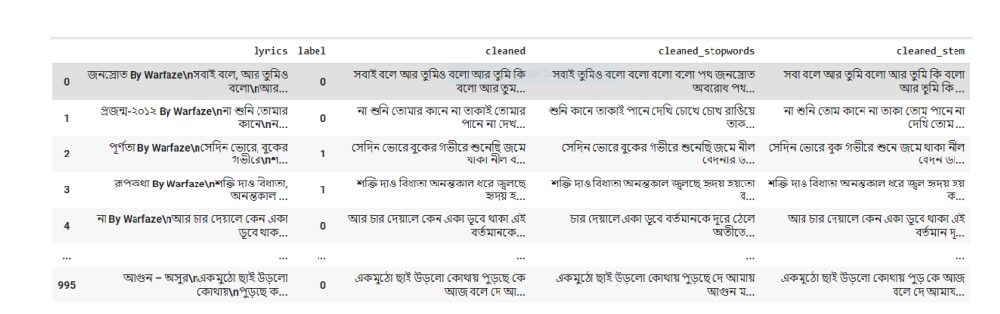

# Project Title:
Bengali Song Lyrics Emotion Analysis.
# Description:
Songs are a way to express our emotion and harmony through vocal or instrumental sounds or both. Songs usually have a meter or beat. Whether we sing or speak the lyrics, we can feel a pattern or pulse in the way the words move the song forward. Here lyrics play a major role to make a song cheerful or emotional to the audience. In this project, emotion was analyzed from Bengali song lyrics and the lyrics were detected as sad songs or not sad song.

# Dataset:
A unique dataset is created which has 1000 song lyrics and labels the lyrics as sad or not sad. These lyrics are collected from different websites which lyrics are available publicly.
# Data Collection:
Dataset was collected from various open source Website of bengali song lyrics
which are publicly available. After collecting 1000 lyrics we manually labeled the dataset
as Sad = 1 and not sad = 0. In the dataset there are 567 not sad song and 433 sad song.
# Data Preprocessing:
In preprocessing part white space, comment, quotation symbol or other unwanted character were removed from the dataset.
Then stopwords were removed which are available online to remove irrelevant words from the
dataset.
Word stemming was also used to get the root words.
In feature extraction part count vectorizer, tfidf transformer, bigram and trigram
model were used.

# Methodology:
Machine learning classifying algorithms like Multinomial Naive Bayes , K-Nearest Neighbours, Support Vector Machine, Logistic Regression, Random Forest, and Decision Tree Classifier were used. Then one boosting classifier XGBoost was used.
For training, 70% of the data was used and the rest of the 30% was for testing
purpose as that is ideal. After training the models, the models were evaluated with the test
data based on Accuracy, Precision, Recall and F1 scores.

# Result:
Support Vector Machine (SVM) per formed the best with an accuracy of 73%, Precision 73%, Recall 73%, F1 Score 73% on Experiment with word stemming and trigram feature extraction. The second best result is shown by Logistic Regression.
# Language:
Python
# IDE:
Google Colab
