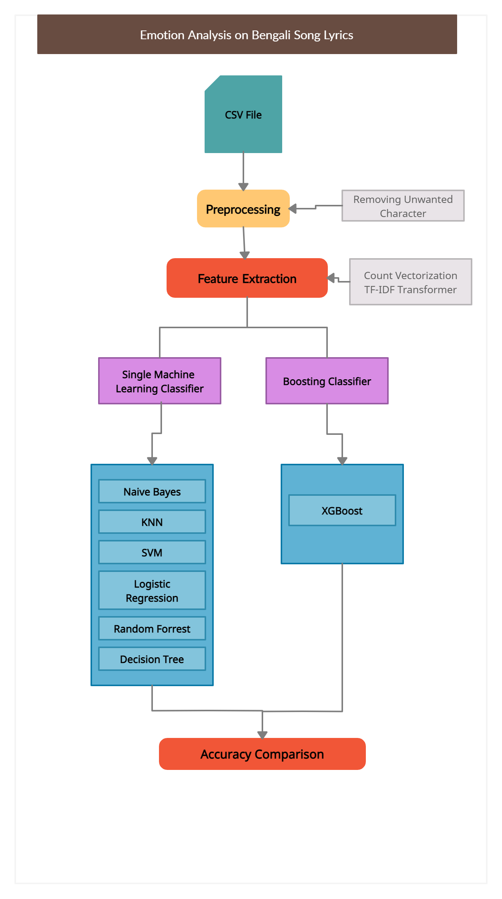

# Project Title:
Bengali Song Lyrics Emotion Analysis.
# Description:
Songs are a way to express our emotion and harmony through vocal or instrumental sounds or both. Songs usually have a meter or beat. Whether we sing or speak the lyrics, we can feel a pattern or pulse in the way the words move the song forward. Here lyrics play a major role to make a song cheerful or emotional to the audience. In this project, emotion was analyzed from Bengali song lyrics and the lyrics were detected as sad songs or not sad song.

# Dataset:
A unique dataset is created which has 1000 song lyrics and labels the lyrics as sad or not sad. These lyrics are collected from different websites which lyrics are available publicly.
# Model:
Machine learning classifying algorithms like Multinomial Naive Bayes , K-Nearest Neighbours, Support Vector Machine, Logistic Regression, Random Forest, and Decision Tree Classifier were used.
# Result:
Support Vector Machine (SVM) per formed the best with an accuracy of 73%, Precision 73%, Recall 73%, F1 Score 73% on Experiment with word stemming and trigram feature extraction. The second best result is shown by Logistic Regression.
# Language:
Python
# IDE:
Google Colab

